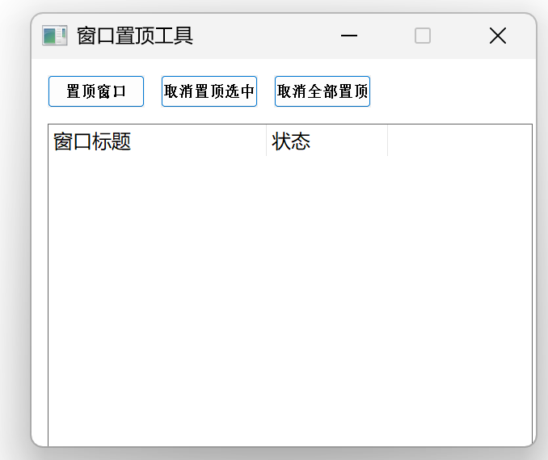

# C++窗口置顶小程序

#### 介绍 
C++窗口置顶小程序,类似于deskpin

可以复制main.cpp文件使用，也可以直接下载.exe文件，最终界面效果如下图。

个人使用感觉还不错，体积很小反应也很快，不足的是有些窗口无法置顶。

# C++ Window-Topper Mini-Tool

#### Description  
A lightweight C++ utility that pins any window to the top—think of it as a DeskPin clone.

You can either copy the **main.cpp** file into your project or simply download the ready-to-run **.exe**. The final interface is shown below.

In my daily use it feels snappy and takes up almost no space. The only downside I’ve noticed is that a few windows can’t be pinned successfully.
